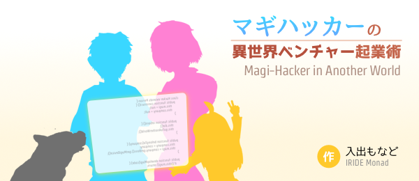

# マギハッカーの異世界ベンチャー起業術 

ハッカーと呼ばれる存在に憧れてプログラマとなり、天才ハッカーとまで呼ばれるようになった白石番兵は、過酷なデスマーチ中に力尽きる。次に目を覚ますとそこは、プログラミング言語で作られた魔法のような「マギサービス」が人々の生活を支えている異世界だった。

スマートフォンのようなマギデバイス、プログラミング言語のようなマギランゲージ。知れば知るほど魔法の仕組みに魅了されていく番兵は、次々と非常識な魔法を生み出し周囲を驚かせ、世界の謎を解き明かしていく。

マギサービスのベンチャー企業立ち上げを目論む女社長に巻き込まれ、最高技術責任者（CTO）として会社を経営に関わりながら、魔法の達人「マギハッカー」を目指して今日も魔法のコードを書きまくる！

## リンク
- [小説家になろう内の小説ページ](http://ncode.syosetu.com/n5191dd/)
- [カクヨム内の小説ページ](https://kakuyomu.jp/works/4852201425154996024)
- [GitHub](https://github.com/io-monad/magi-hacker)

## 作者
入出もなど / IRIDE Monad

- ブログ: [もなでぃっく](http://io-monad.hatenablog.com/)
- メール: iride.monad@gmail.com
- Twitter: [@io_monad](https://twitter.com/io_monad)
