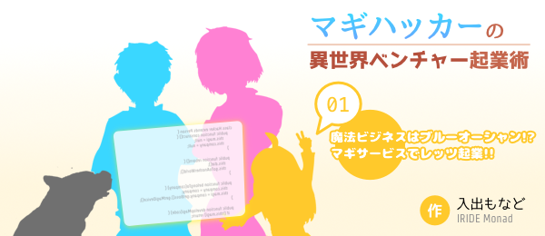

<!-- This file was auto-generated by `gulp build:summary`. Don't edit this file! -->
# 目次

「マギハッカーの異世界ベンチャー起業術」の目次です。

* [用語集](GLOSSARY.md)

## Ch.01 - 魔法ビジネスはブルーオーシャン!? マギサービスでレッツ起業!!

* [Ch.01 - 魔法ビジネスはブルーオーシャン!? マギサービスでレッツ起業!!](chapter-01/README.md)
    * [001 - hacker.die();](chapter-01/001.txt)
    * [002 - hacker.say(&quot;Hello, world!&quot;);](chapter-01/002.txt)
    * [003 - hacker.crawl(library);](chapter-01/003.txt)
    * [004 - hacker.meet(boss);](chapter-01/004.txt)
    * [005 - hacker.belongTo(new Company());](chapter-01/005.txt)
    * [006 - hacker.carry(boss);](chapter-01/006.txt)
    * [007 - hacker.learn(MagiLanguage);](chapter-01/007.txt)
    * [008 - hacker.discuss(business).with(boss);](chapter-01/008.txt)
    * [009 - hacker.meet(backer);](chapter-01/009.txt)
    * [010 - hacker.ignore(sparkles);](chapter-01/010.txt)
    * [011 - hacker.setFlag(true);](chapter-01/011.txt)
    * [012 - boss.understand(hacker);](chapter-01/012.txt)
    * [013 - hacker.flash();](chapter-01/013.txt)
    * [014 - hacker.hack(wall);](chapter-01/014.txt)
    * [015 - hacker.pat(apple);](chapter-01/015.txt)
    * [016 - hacker.spacewalk();](chapter-01/016.txt)
    * [017 - hacker.has(ambition);](chapter-01/017.txt)
    * [018 - hacker.develop(headache);](chapter-01/018.txt)
    * [019 - hacker.develop(Phone);](chapter-01/019.txt)
    * [020 - hacker.freeze();](chapter-01/020.txt)
    * [021 - hacker.enjoy(AnotherWorld);](chapter-01/021.txt)
    * [CoffeeBreak 01 - hacker.explain(Phone);](chapter-01/cb1.txt)
    * [CoffeeBreak 02 - c.apologize();](chapter-01/cb2.txt)

## Ch.02 - サービス運営は前途多難!? 異世界のキャズムをぶっ越えろ!!

* [Ch.02 - サービス運営は前途多難!? 異世界のキャズムをぶっ越えろ!!](chapter-02/README.md)
    * [022 - hacker.setSummoned(true);](chapter-02/022.txt)
    * [023 - hacker.isLazy();](chapter-02/023.txt)
    * [024 - hacker.hook(stone, &quot;transfer&quot;);](chapter-02/024.txt)
    * [025 - hacker.diveInto(sea);](chapter-02/025.txt)
    * [026 - hacker.setState(SEARCHING);](chapter-02/026.txt)
    * [027 - hacker.infer(man, &quot;kind&quot;);](chapter-02/027.txt)
    * [028 - hacker.identify(wirepuller);](chapter-02/028.txt)
    * [029 - hacker.expose(wirepuller.character);](chapter-02/029.txt)
    * [030 - hacker.loadFile(&quot;hoge.magi&quot;).run();](chapter-02/030.txt)
    * [031 - hacker.encounter(gate);](chapter-02/031.txt)
    * [032 - hacker.sow(seeds);](chapter-02/032.txt)
    * [033 - hacker.cross(chasm);](chapter-02/033.txt)
    * [034 - hacker.try(-&gt; { hacker.undo() });](chapter-02/034.txt)
    * [035 - hacker.encourage(boss);](chapter-02/035.txt)
    * [036 - hacker.write(&quot;Hello, world!&quot;);](chapter-02/036.txt)
    * [037 - hacker.reach(truth);](chapter-02/037.txt)
    * [038 - boss.understand(herself);](chapter-02/038.txt)
    * [039 - hacker.make(presentation);](chapter-02/039.txt)
    * [040 - hacker.pointOut(blindSpot);](chapter-02/040.txt)
    * [041 - hacker.check(criminal);](chapter-02/041.txt)
    * [042 - hacker.move(forward);](chapter-02/042.txt)
    * [CoffeeBreak 03 - hacker.gain(trust);](chapter-02/cb3.txt)
    * [CoffeeBreak 04 - c.cook(soup);](chapter-02/cb4.txt)

## Ch.03 - バンペイ先生の常識破壊レッスン!? ばらまけイノベーションの種!!

* [Ch.03 - バンペイ先生の常識破壊レッスン!? ばらまけイノベーションの種!!](chapter-03/README.md)
    * [043 - hacker = new Teacher();](chapter-03/043.txt)
    * [044 - hacker.start(lesson);](chapter-03/044.txt)
    * [045 - hacker.throwAway(CommonSense);](chapter-03/045.txt)
    * [046 - hacker.start(game);](chapter-03/046.txt)
    * [047 - student.standBy();](chapter-03/047.txt)
    * [048 - student.wantTo(&quot;escape&quot;);](chapter-03/048.txt)

